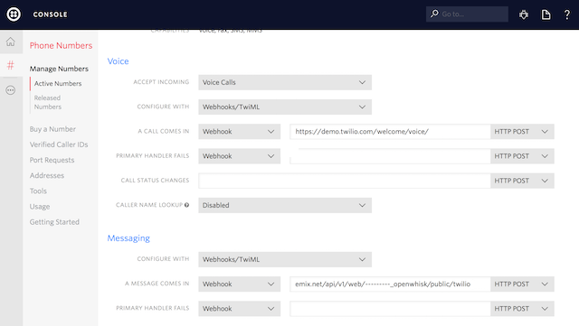

# Twilio to Watson IoT OpenWhisk Action

OpenWhisk Web Action that relays text messages from Twilio to a Watson IoT device as a device even/command.

Use the OpenWhisk Web Action URL in the callback URL for a Twilio SMS number. Each time a text message is sent to the Twilio phone number, a device event/command is relayed to a device registered in the Watson IoT Platform.


## Configuration

Register a Watson IoT device (if you don't have an Watson IoT Platform Bluemix service, [create one here](https://console.ng.bluemix.net/catalog/services/internet-of-things-platform)).

| Values | Description |
|--------| ------------- | 
| deviceId | only the digits of the Twilio number (i.e. `15555555555`) |
| deviceType | `twilio` (or the value of custom deviceType passed in via the Web Action URL) |

Example device credentials created in Watson IoT Platform:


Add the IoT org, API Key and Authentication Token (found under Apps in the Watson IoT dashboard) in the file local.env


Example local.env file using API Key from screenshot above:

```
IOT_ORG=ynwgem
IOT_API_KEY=a-ynwgem-rjweszhdz3
IOT_API_TOKEN=Q6Uq4zS5h!2z_VQSfm
```

## OpenWhisk 

### Install OpenWhisk CLI

[Download](https://openwhisk.ng.bluemix.net/cli/go/download/) the OpenWhisk CLI installer for your operating system.

### Set OpenWhisk API Namespace and Authorization Key

Copy the command in Step 2 and run the command to set the OpenWhisk API Namespace and Authorization Key.
 


### Build OpenWhisk Action

To rebuild the zip file that is used by the OpenWhisk action, run the command:

```
./deploy.sh --build
```

### Install OpenWhisk Action

To add the OpenWhisk Action, run the command:

```
./deploy.sh --install
```

### Update OpenWhisk Action

If you change the OpenWhisk Action, first (re)build the zip file:

```
./deploy.sh --build
```

Then run the command to update the OpenWhisk action:

```
./deploy.sh --update
```

### Show IoT Environment 

To display the IoT credentials, run the command:

```
./deplay.sh --env
```

### Remove OpenWhisk Action

To remove the OpenWhisk Action, run the command:

```
./deploy.sh --uninstall
```

Note: this will not remove the package

## Call OpenWhisk Web Action From Twilio

After you deploy the web action, return to the OpenWhisk dashboard in IBM Bluemix. Click on the **Manage** tab.


Click on the OpenWhisk action labeled `twilio`. Click on **Additional Details** in the left menu. The URL to the OpenWhisk Web Action is displayed. 


Copy this URL into the **Messaging webhook** for the Twilio phone number in the Twilio console, **removing the .json extension**. This will return a TwiML response to the Twilio service.



Send a text message to the Twilio number. In the Watson IoT Platform dashboard, an event should contain the message received.


## OpenWhisk Web Action Options

The OpenWhisk Web action takes several optional query parameters that alter the behavior of how the message is relayed to the Watson IoT Platform. These parameters are optional with default values provided.

### deviceType [default: twilio]

Set the deviceType of the Watson IoT device message is relayed to.

```
<<WEBACTIONURL>>?deviceType=anotherTypeOfDevice
```

### deviceId [default: value of the To parameter]

Set the deviceId of the Watson IoT device message is relayed to. If not present, will use the value of the To parameter.

```
<<WEBACTIONURL>>?deviceId=anotherDeviceId
```

### To

If deviceId parameter is not present, the deviceId will be set to the numeric characters in the To parameter. For example, when To has the value `+15555555555`, deviceId will be `15555555555`.

```
<<WEBACTIONURL>>?To=+15555555555
```

### sendAs [default: event]

Choose whether the message is relayed as a Device Command or Device Event.

```
<<WEBACTIONURL>>?sendAs=command
```
```
<<WEBACTIONURL>>?sendAs=event
```

### eventType [default: sms]

Set the event/command type that the message is relayed as.

```
<<WEBACTIONURL>>?sendAs=event&eventType=sms
```
```
<<WEBACTIONURL>>?sendAs=command&eventType=processMessage
```


